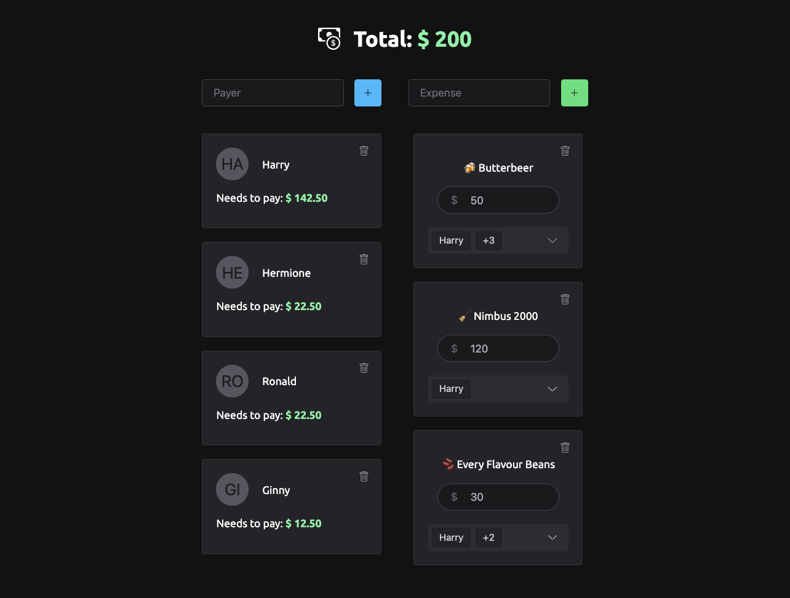

<!-- <p align="center"></p> -->
<h1 align="center">Simple Bill Splitter</h1>

<p align="center">
  <a href="#-running">Running</a>&nbsp;&nbsp;&nbsp;|&nbsp;&nbsp;&nbsp; 
  <a href="#-technologies">Tecnologies</a>&nbsp;&nbsp;&nbsp;|&nbsp;&nbsp;&nbsp;
  <a href="#-license">License</a>
</p>

<p align="center">
  <a href="#-license">
    
  </a>
</p>

<p align="center">Simple Bill Splitter is a web system that calculates bills between you and your friends.</p>

<br />

<p align="center" style="border: 5px solid hsl(240 4.6% 22%);">
  
</p>

<br />

## 💻 Running

**Requirements**:

- `node >= 18.16.0`
- `yarn >= 1.22.19`

#### 1. Clone the application

```sh
git clone https://github.com/arthursvpb/simple-bill-splitter.git
```

#### 2. Install dependencies & Run local dev server

```sh
yarn && yarn dev
```

#### 3. Project is running at: `http://localhost:8080/`

## ✨ Technologies

- [Web Components](https://developer.mozilla.org/en-US/docs/Web/API/Web_components)
- [Lit Element](https://lit.dev/)
- [Shoelace](https://shoelace.style/)
- [Zustand](https://github.com/pmndrs/zustand)

## 📝 License

This project is under the MIT license. See the [LICENSE](LICENSE) file for more details.
